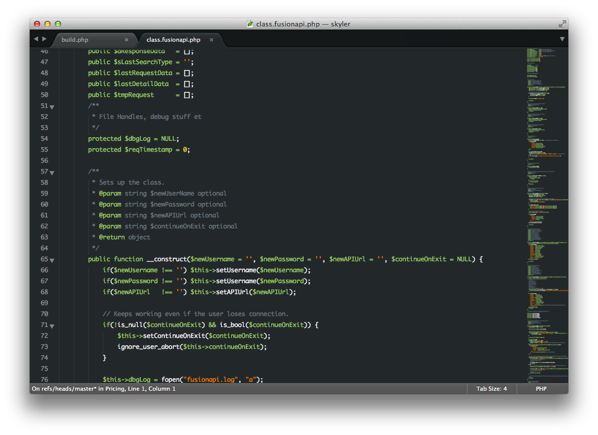

Introduction
============

This is a tmTheme for [textmate](http://macromates.com/) which also works on [Sublime Text 2] (http://www.sublimetext.com/2) and [Sublime Text 3] (http://www.sublimetext.com/3).

It is inspired by the Visual Studio theme [Son of Obsidian](http://studiostyl.es/schemes/son-of-obsidian) which also is inspired by Eclipse [Obsidian](http://www.eclipsecolorthemes.org/?view=theme&id=21).

I am using it mainly for html and javascript, feel free to enhance and send me the changes.

## Installation 

Download the file or install with [Package Decontrol](https://github.com/jfromaniello/Sublime-Package-Decontrol):

~~~
jfromaniello/sublime-node-require
~~~

## How to install in TextMate?

I don't know but it might be something like:

	~/Library/Application Support/TextMate/Themes

## How to install manually (tested in Sublime Text 3)

1. Click Preferences -> Browse Packages...
2. Create a new folder called "Grandson-of-Obsidian" (or whatever you'd prefer it be named)
3. Copy the GrandsonOfObsidian.tmTheme to that folder
4. Click Preferences -> Color Scheme -> Grandson-of-Obsidian -> GrandsonOfObsidian.tmTheme
